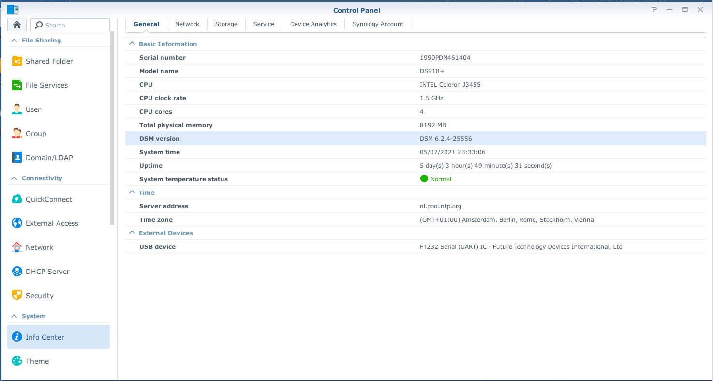
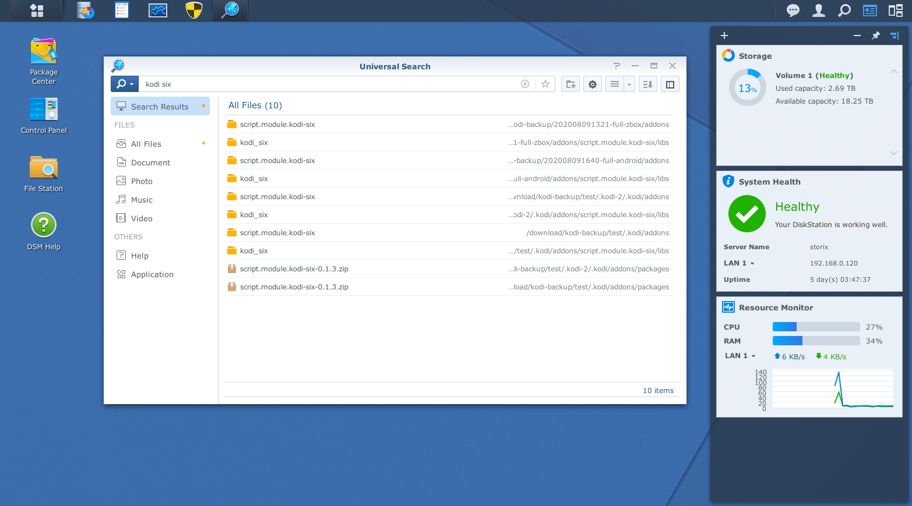
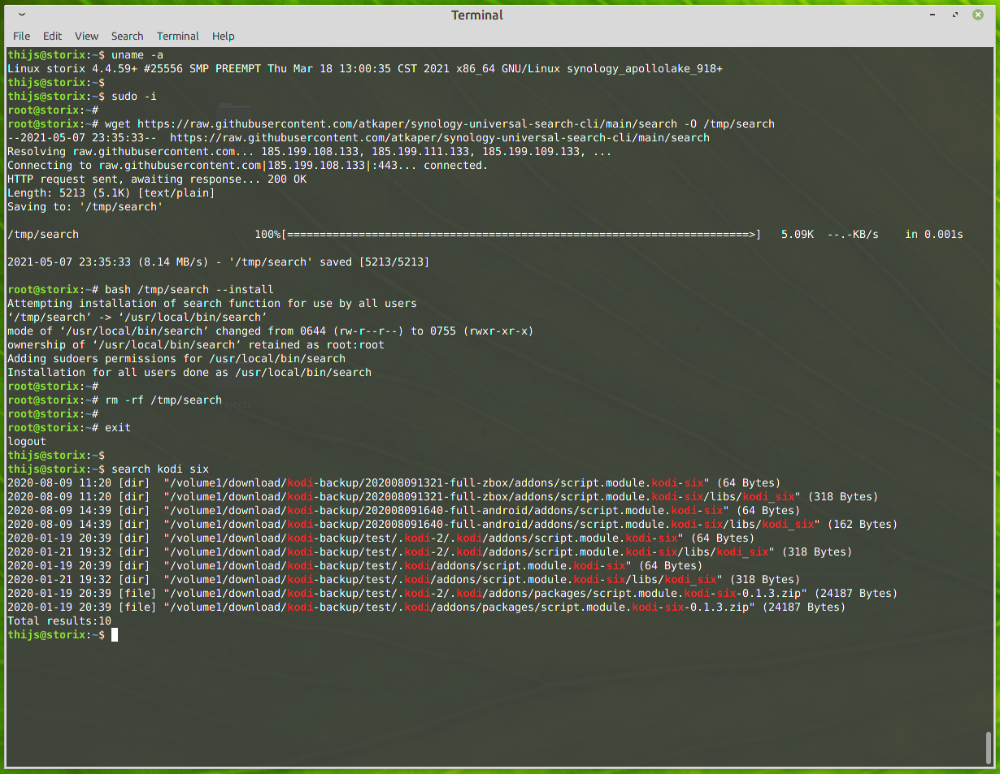

# Synology Universal Search CLI (Command line interface)

See also blog post: https://www.kaper.com/software/synology-universal-search-cli/

Command line tool to execute Synology "Universal Search" from within a shell.

The web-gui on a synology NAS has a thing called "Universal Search". I wanted to be able to use this
from the shell command line on the NAS also, and therefore created this script.

## Requirements:

- A configured universal search (via the web-gui), which has indexed the folders to be searched.
- Root shell access to install the search.

## Installation:

- Log on as root to a command line shell (login as admin user, and type "sudo -i" to get to the root shell).
- Run "wget https://raw.githubusercontent.com/atkaper/synology-universal-search-cli/main/search -O /tmp/search"
- Optional: Look at the script, before trusting to run it: "cat /tmp/search"
- Run the downloaded script using "bash /tmp/search --install".
- Run "rm -rf /tmp/search"

The above install will copy the script to /usr/local/bin/search, and setup sudo rights to execute it.
The sudo rights are needed for "normal" non-root users to be able to execute "synowebapi", which is used in this script.
Note: an attempt has been made to make this somewhat safe, but keep in mind that this script runs as root, so
if there are any loopholes to let it execute any other sub commands, not included in the script, then you
will expose root access to your logged on users. Let me know if you find any security holes ;-)
I'm not too bothered by this, as I'm the only shell user on my NAS.

Note: if a synology OS update is done, you could lose the passwordless sudo setup. To fix this, just run
"search --install" to re-install the sudo configuration.

Note: if you do NOT want to "install" the script for all users, you can also just copy it manually to /usr/local/bin, 
and always run it with: "sudo search [searchterm]". 

Thijs Kaper, May 7, 2021.

## Synology Version

## Synology GUI example search

# Installation and example cli run

